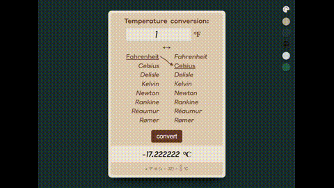

# Temperature Conversion
Bu kiçik və sadə layihə **temperatur çevirmək** üçündür.
İstifadəçi daxil etdiyi temperaturu **Celsius ↔ Fahrenheit** olaraq çevirmək olur.

# Proyekt haqqında
Bu layihə 100% HTML, CSS və JavaScript ilə yazılıb.
Sadə UI və rahat istifadə üçün hazırlanıb.

code link: <a href="https://codepen.io/orxan4/pen/azZzybK" target="_blank">https://codepen.io/orxan4/pen/azZzybK</a>
